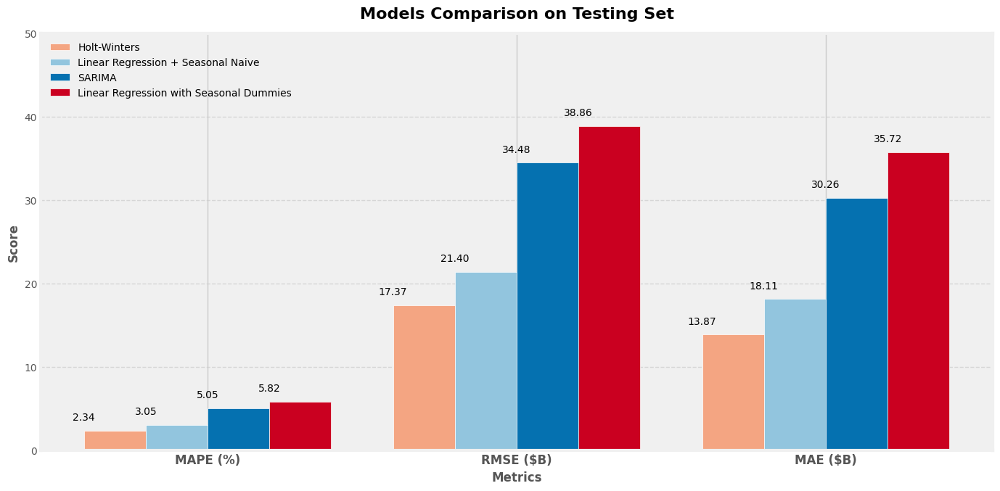
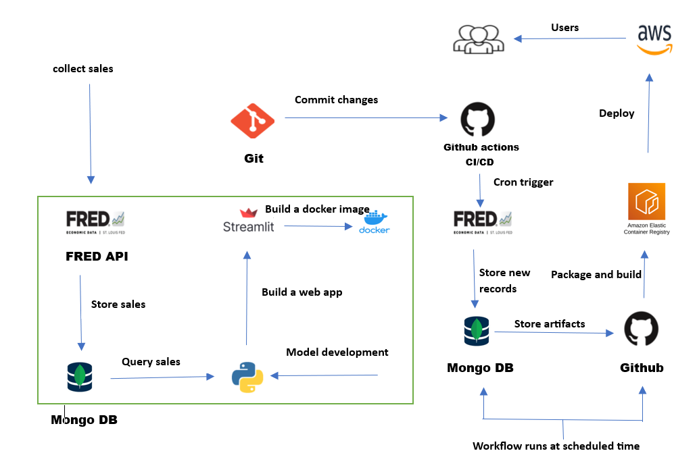

# Retail Sales Forecasting and Monitoring  
[](https://www.python.org/)

# Project Overview  
The **Retail Sales Forecasting and Monitoring** project is designed to provide real-time analysis and forecasting for the retail sales sector in the US market. This project offers valuable insights into sales performance across various retail categories, both durable and non-durable goods, allowing businesses to make data-driven decisions based on consumer spending patterns and industry health.

# Motivation  
Retail sales represent the total revenue generated by retail establishments across different categories in the US, offering a comprehensive overview of consumer spending habits. Monitoring and forecasting these sales are essential for:  
- **Business Performance Assessment**: Identifying trends and optimizing strategies.  
- **Inventory Management**: Adjusting stock based on demand predictions.  
- **Operational Efficiency**: Streamlining resource allocation and improving decision-making.

**Forecasting Models** empower stakeholders—retailers, manufacturers, and policymakers—to anticipate future sales trends, allowing them to:  
- Plan inventory effectively.  
- Allocate resources wisely.  
- Tailor marketing strategies to future consumer demand.

# Data Collection & Model Development  

The dataset for this project was sourced from the [Federal Reserve Economic Data (FRED) platform](https://fred.stlouisfed.org/series/RSXFSN), covering **January 1992 to September 2024**. Forecasting extends from **November 2024 to September 2025**.  

Given the dataset’s trend and seasonal characteristics, several forecasting models were explored:  

## Models Considered  
1. **Linear Regression with Seasonal Dummies**: Captures seasonal effects through dummy variables in a linear regression framework.  
2. **Holt-Winters Model**: Uses exponential smoothing to capture level, trend, and seasonality.  
3. **Decomposition Forecasting (Linear Regression & Seasonal Naïve)**: Separates trend, seasonality, and residuals, using:  
   - **Linear Regression** for trend.  
   - **Seasonal Naïve** for seasonality (assumes future sales mirror previous year’s season).  
4. **SARIMA (Seasonal AutoRegressive Integrated Moving Average)**: Captures seasonality, trend, and noise in time-series data.

## Model Selection  
The **Holt-Winters Model** was chosen for its:  
- High accuracy and reliable confidence intervals.  
- Adherence to statistical assumptions.  
- Interpretability for non-technical stakeholders.  
- Development efficiency.

Including confidence intervals ensures reliable, actionable insights for effective planning and strategic decision-making.



# Features  
- **Confidence Intervals**: Indicate prediction reliability and uncertainty, aiding proactive decision-making.  
- **Automated Updates**: Real-time data retrieval from FRED API for continuous monitoring.  
- **Performance Tracking**: Evaluates model accuracy with metrics like **MAPE**, **RMSE**, and **MAE**.  

# Workflow  


# Interactive Notebooks  

| **Notebook**                        | **Colab Link**                                                                                                              |
|-------------------------------------|----------------------------------------------------------------------------------------------------------------------------|
| **Data Collection**                 | [](https://colab.research.google.com/drive/1fROcpZnVFW5KSqieL2zdPdw29HqtuhuA?usp=sharing) |
| **Decomposition Forecasting**        | [](https://colab.research.google.com/drive/1_5UteZylHMvbnxQ26VrPc258wk90r-HJ?usp=sharing) |
| **Holt-Winters Model**              | [](https://colab.research.google.com/drive/1RNxNOKsNn4NmPieB5p4FBJIdX_9pqxW5?usp=sharing) |
| **Linear Regression with Dummies**  | [](https://colab.research.google.com/drive/1FJLdOawg7x1I7c4eIrZHtKHlAyHcrOAk?usp=sharing) |
| **SARIMA**                          | [](https://colab.research.google.com/drive/1ZG1I5OOyeQT-XQ4lCMwXONXvBFSoNW0D?usp=sharing) |

# Installation

Follow these steps to install and run the project locally:

Set up a virtual environment (optional but recommended):

```bash
python -m venv env
env\Scripts\activate.bat
```

```bash
git clone https://github.com/rakshitha2207/retailsalesforecasting.git
cd <project-directory>
pip install -r requirements.txt
streamlit run app.py
```

Access the web application by opening the following URL in your web browser:

```bash
http://localhost:8501
```

<!-- If you prefer to use a Docker image, you can follow these additional steps:

Pull the Docker image from Docker Hub:
```bash
docker pull rakshitha919/retailsales_app:latest
```
Run the Docker container:
```bash
docker run -p 8501:8501 retailsales_app:latest
```
Access the web application using the same URL as mentioned above. -->

# Usage

The interactive dashboard provides forecasted values for the next 24 months, from May 2023 to April 2025. It automatically retrieves new sales observations from FRED using the FRED API and displays them on the dashboard. The stars marker represents the actual values on the dashboard.

When a new sales observation is obtained, it is evaluated against the forecasted values to assess the performance of the model. The evaluation metrics used are MAPE (Mean Absolute Percentage Error), RMSE (Root Mean Squared Error), and MAE (Mean Absolute Error). These metrics provide insights into the model's performance and help identify outliers or the need for model retraining to adapt to changing market behavior.

The performance metrics are color-coded, with red indicating that the new observation has worsened the model's performance compared to the previous evaluation since the last observation date. The new sales observation is added to the testing set used during model evaluation and compared with the forecasted values generated during model development besides the new forecasted values dispayed on the dashboard. The two sets are evaluated using the three metrics, and the performance metrics are updated accordingly.

If the new sales observation negatively impacts the model's performance, the performance metrics will be flagged to indicate the deterioration. This serves as an alert to consider retraining the model to maintain its accuracy and adaptability to the ever-changing market dynamics.

By monitoring the performance metrics, users can track the model's reliability and identify potential issues when new observations are added.


# License

[GNU General Public License v3.0](https://github.com/rakshitha2207/retailsalesforecasting/blob/main/LICENSE)

   
